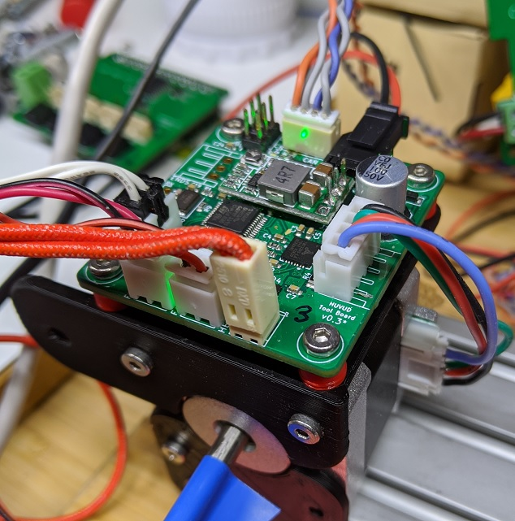

# Huvud 3D Printer toolhead board
A very small 3D printer board for use on a toolhead. It is designed to be used with Klipper firmware.

Features: 
* TMC2209 driver
* STM32F042C6T6
* Two MOSFET drivers fans
* One bigger MOSFET driver for a hotend heater
* Thermistor input
* One endstop
* CAN bus

Main power is 12-24V. 24V is preferred to keep the currents low

The CAN Bus is not terminated, instead it uses 4 wires, termination should be done at the other end.

It uses an external 3.3V switch regulator. 

All done in KiCad

Possible issues:

* Is the cooling for the TMC2209 adequate? Seems to be, the board reaches about 50C under the TMC2209 when running a small stepper at 1A.

Change ideas:

Is the endstop useful? Could be used as a filament runout sensor.

---

2020-05-18:

First prototype production run is done.

The board works mostly as intended. Some quick tests shows that the MCU can run klippy, stepper drivers, fan drivers and thermistors works perfectly fine.

2020-05-29:

After a lot of software work and many hours of testing I can report that everything actually works as intended (except one resistor that should have been 1k was a 10k)

* The thermistor input gives a very low noise signal, even at high temperatures.
* Endstop works
* All mosfet outputs works with reasonable loads (2A at 24V). I do not have a dummy load for very high load testing, but a heater on the FAN connectors and a hotbed to the heater connector...
* The thermals of the TMC2209 seems ok. With no cooling fins or active cooling it reaches 60C (top and bottom) when mounted close to a hot stepper. I should test with a larger stepper (>1.5A) in a hotter environment to see when the TMC shuts down.
* The CAN bus works good after some software work. It should work fine with up to 8 nodes on each bus, possibly more. I have run 4 boards on the same bus, each with one stepper, simulating a complete 3D printer.

It is possible to fit different connectors for most functions. It is designed for mostly angled JST-XH or screw terminals but it's possible to find straight connectors or other 2.54mm for most functions. JLCPCB do not mount through holes so the boards come without connectors.

