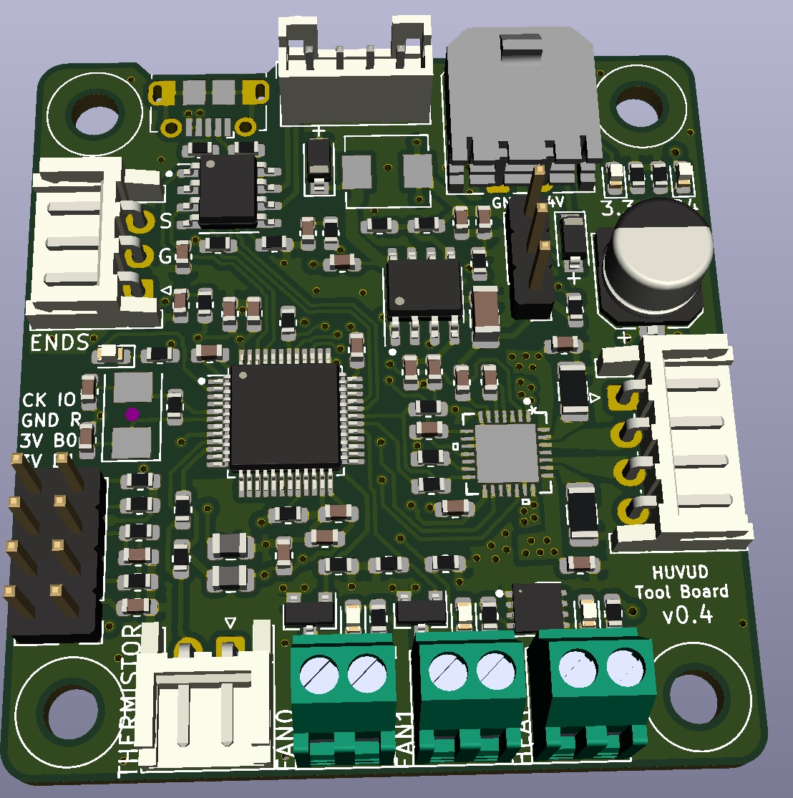

# Huvud 3D Printer toolhead board
A very small 3D printer board for use on a toolhead. It is designed to be used with Klipper firmware.

Features: 
* TMC2209 stepper driver
* STM32F103 72Mhz MCU
* Two MOSFET drivers fans
* One bigger MOSFET driver for a hotend heater
* Thermistor input
* One endstop
* CAN bus
* USB

Main power is 12-24V. 24V is preferred to keep the currents low

All done in KiCad and open source. 

Change ideas:

* Find a better heater mosfet, our 3.3V Vgs is on the low side for that chip.

---

2020-05-18:

First prototype production run is done.

They work!

2020-05-29:

After a lot of software work and many hours of testing I can report that everything actually works as intended (except one resistor that was a 10k insteadof 1k)

* The thermistor input gives a very low noise signal, even at high temperatures.
* Endstop works
* All mosfet outputs works with reasonable loads (2A at 24V). I do not have a dummy load for high load testing, but a heater on the FAN connectors and a hotbed to the heater connector...
* The thermals of the TMC2209 seems ok. With no cooling fins or active cooling it reaches 60C (top and bottom) when mounted close to a hot stepper. I should test with a larger stepper (>1.5A) in a hotter environment to see when the TMC shuts down. I am considering a different fab that allows thicker copper layers for better heat spead, and better power margins.
* The CAN bus works good after some software work. It should work fine with up to 8 nodes on each bus, possibly more. I have run 4 boards on the same bus, each with one stepper, simulating a complete 3D printer.

It is possible to fit different connectors for most functions. It is designed for mostly angled JST-XH or screw terminals but it's possible to fit straight connectors or other 2.54mm for most functions. JLCPCB do not mount through holes so the boards come without connectors.
For a larger (>30) production run the boards would have to be panellized, which looks like a non-trivial task with KiCAD. If anyone has experience and wants to help ...

2020-06-10:

Version 0.4 is almost complete.

* It has an on-board 3.3V regulator replacing the external board. (Quite a challenge for an old SW engineer using JLCPCB's very limited selection of components)
* Thermistor connector moved down next to the fan/heater connectors
* Lower profile capacitor for the stepper driver, it was very tall.
* Debug header moved and extended. BOOT1 exposed.
* Serial pins removed, not very useful anyway
* Fan/heater connectors tweaked to be able to fit JST XH, screw terminals or Molex KK connectors.
* Added a micro-USB connector for easier flashing and possibly other features. The board is not powered from USB.
* Switched to an STM32F106, mainly to allow for a proper bootloader and flashing over USB. Or even over CAN if I develop a custom bootloader. With many boards it would be very nice to be able to bulk flash them all at once over CAN.

I have done thermal stress testing of the board. It can run a big stepper at 1.5A, board attached very close to the hot stepper with no forced airflow and 25C ambient. The driver reaches 90C (measured with a probe) but does not shut down due to overheating. The entire board heats up as designed to act as a heatsink, most inner and outer copper layers are groundplanes to spread the heat. 

I'll very soon order another 20-30 board to send out to brave beta testers.

# Can Hat

As a sub project to this board I have developed a little power and CAN distribution board combined with an MCP2515 CAN bus controller in the form of a Raspberry Pi Hat. It is a very simple little board but has turned out to be very valuable.

With some more thought put into it I think it will be a good complement to the Huvud tool board. 

